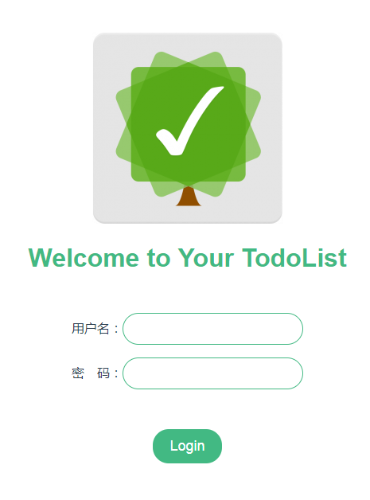
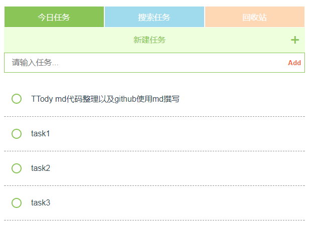
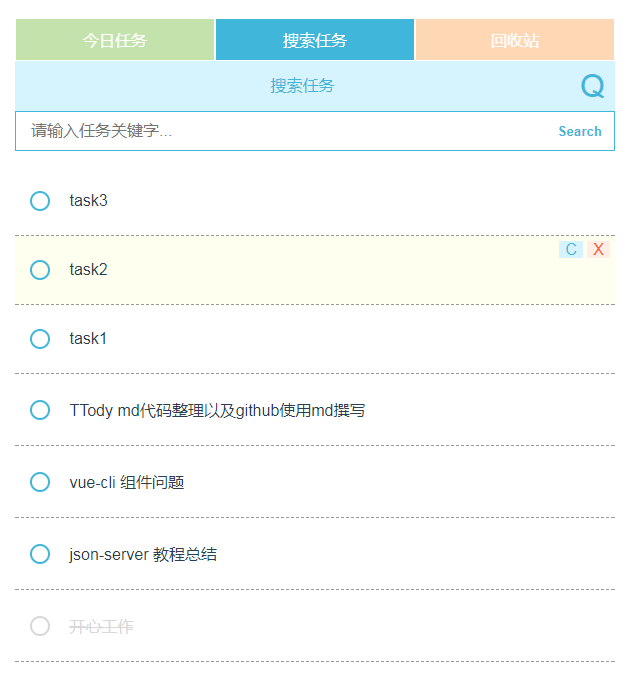
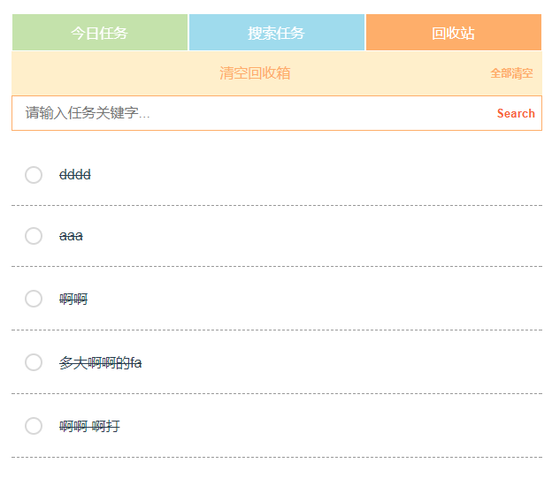

# TTody
  

> A todolist just for today.

## 简介
这是一个用vue-cli & json-server 构建的一个本地 todolist 小项目。  
具有登录、新建任务、搜索任务、删除任务等功能。

## 使用说明
#### 1 环境准备
你需要检测下你的电脑是否安装了 node.js。检测方式：
```
node -v
v8.10.0
```
你还需要安装下json-server：
```
# 使用npm全局安装json-server
npm install -g json-server
```
如果想对json-server进一步了解，可以移步的我的博文[《上手玩一下 json-server（一）了解篇》](https://www.jianshu.com/p/bdbbd3314cf3)、[《上手玩一下json-server（二）操作数据篇——POST/PATCH/DELETE》](https://www.jianshu.com/p/9847dc1f5ca7)
#### 2 启动服务
（1） 进入json-server文件夹，启动json-server服务：
```
json-server --watch db.json
```

（2） 在项目顶层文件夹路径（一般就是TTody文件夹下），启动服务：
``` bash
# server with hot reload at localhost:8080
npm run dev
```

在浏览器输入：localhost:8080。即可访问。

## 功能说明
#### 登录  
登录账号：admin/123456  
该版本没有注册通道，账号密码要修改可以直接到json-server/db.json 文件中进行修改。   
 

#### 新建任务  
登录成功后直接跳转到新建任务。  
新建的任务可以添加备注，可以删除（删除后会进入回收站），点击圆圈表示完成任务。  
 

#### 搜索任务  
搜索任务，默认可以按照时间倒序。可以输入任何关键字进行搜索。  
待补充功能：  
1. 加入时间范围筛选  
2. 加入任务类别筛选  
 

#### 回收站  
回收站是点击删除后得到的数据，还保留在db.json中。
 

